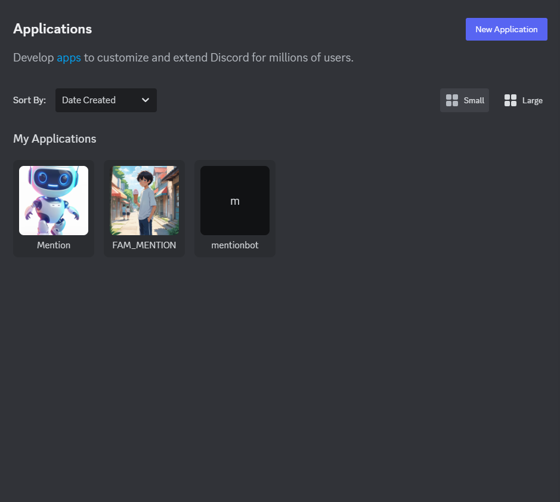
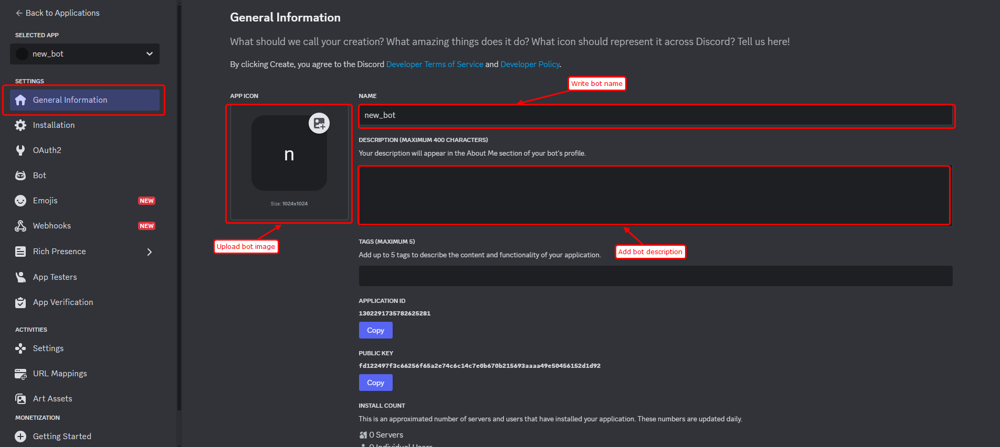
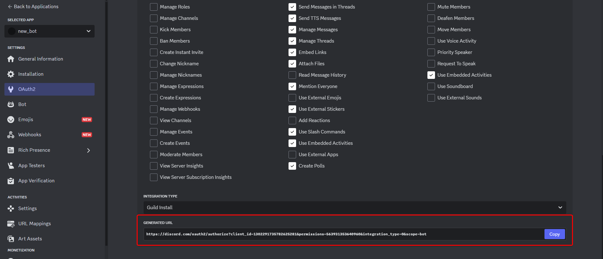
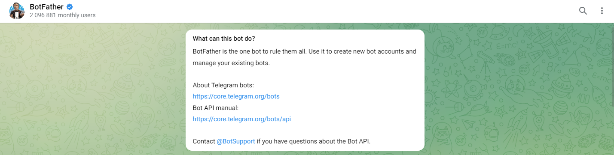
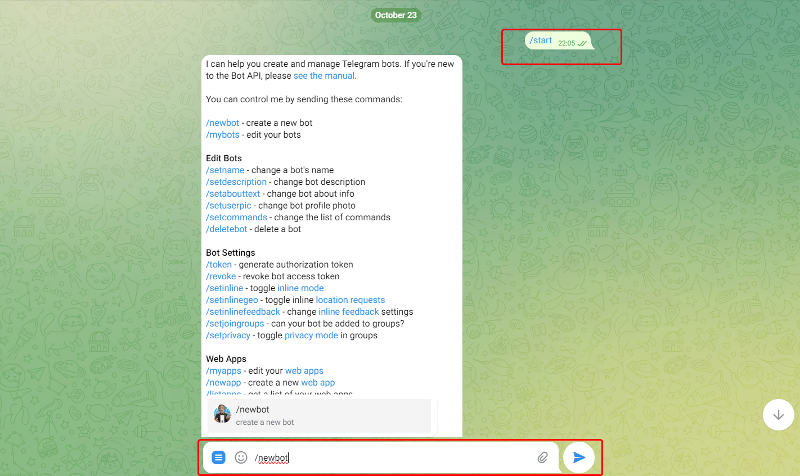
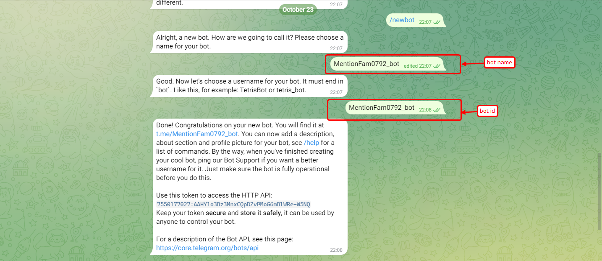
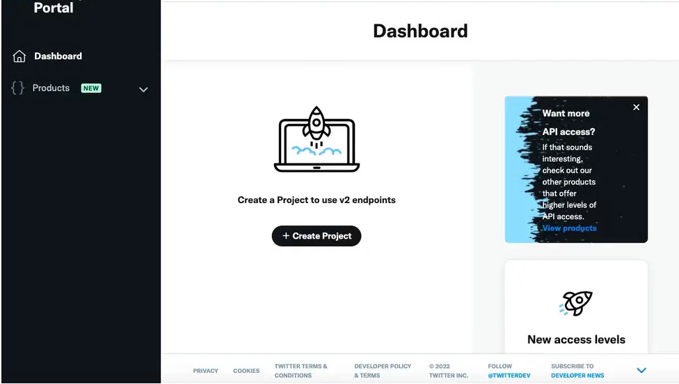
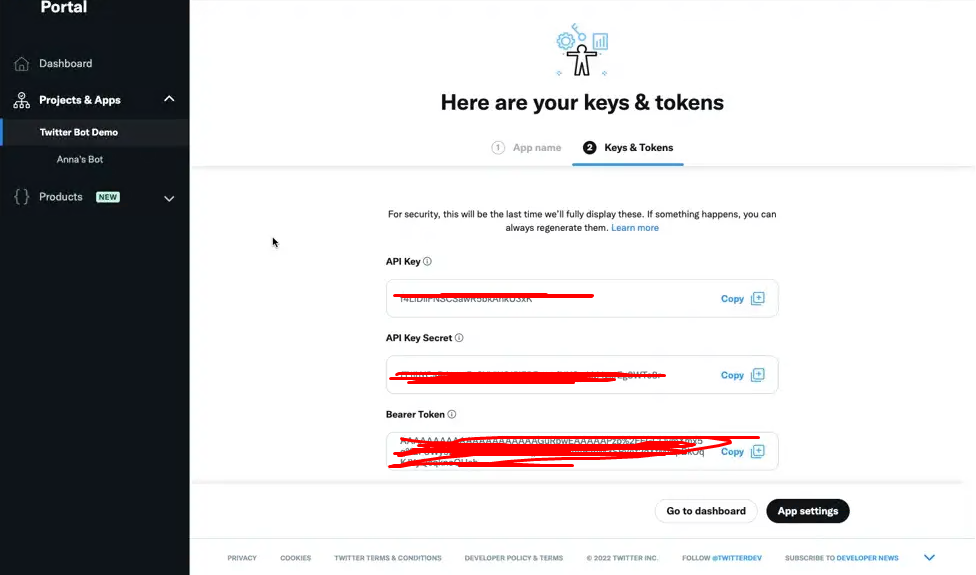
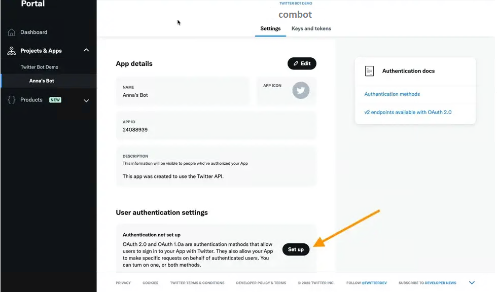

#  Bot Package

** Bot Package** is a Python package that provides a unified interface for three types of bots: **Discord**, **Telegram**, and **Twitter**, all powered by OpenAI’s GPT-4 API. These bots are designed to interact with users, answer questions, and respond to commands in their respective platforms.

## Features

- **Discord Bot**: Responds to commands like `/call` and `/ask` and interacts through a modal.
- **Telegram Bot**: Uses commands `/call` and `/ask` to provide responses in Telegram chat.
- **Twitter Bot**: Listens for mentions and DMs to respond with AI-generated replies.
- **Modular and Scalable**: Built with flexibility to add more platforms or commands.

---

## Getting Started

### Prerequisites

- **Python 3.7+**
- **Environment Variables** (stored in `.env`):
  - `DISCORD_BOT_TOKEN`
  - `TELEGRAM_BOT_TOKEN`
  - `TWITTER_API_KEY`
  - `TWITTER_API_SECRET`
  - `TWITTER_ACCESS_TOKEN`
  - `TWITTER_ACCESS_SECRET`
  - `OPEN_ROUTER_API_KEY`

### Installation

1. **Clone the Repository**

   ```bash
   git clone https://github.com/your-username/my_bot_package.git
   cd my_bot_package

2. **Set Up Environment Variables**
Create a `.env `file in the root directory with your credentials:
    ```plaintext
    DISCORD_BOT_TOKEN=your_discord_token
    TELEGRAM_BOT_TOKEN=your_telegram_token
    TWITTER_API_KEY=your_twitter_api_key
    TWITTER_API_SECRET=your_twitter_api_secret
    TWITTER_ACCESS_TOKEN=your_twitter_access_token
    TWITTER_ACCESS_SECRET=your_twitter_access_secret
    OPEN_ROUTER_API_KEY=your_open_router_api_key
    ```
3. **Install the Package and Dependencies**
   ```bash
   pip install -e .  
   ```
This command installs the package in editable mode along with required dependencies specified in `setup.py`.

## Usage
Once installed, you can start each bot from the command line.

1. Run the Discord Bot
   ```bash
   run_discord_bot
   ```

2. Run the Telegram Bot
   ```bash
   run_telegram_bot
   ```

3. Run the Twitter Bot
   ```bash
   run_twitter_bot
   ```
## Commands and Functionalities
Each bot has specific commands and interactions:

### Discord Bot Commands
- `/call` <message>: The bot replies with a greeting and responds with an AI-generated message.
- `/ask` <question>: The bot displays a button for querying. When clicked, it prompts for user input and returns the AI’s response.
### Telegram Bot Commands
- `/start`: Initiates the bot and displays a welcome message.
- `/call` <message>: The bot greets the user and responds with an AI-generated message.
- `/ask` <question>: Directly sends the question to the bot and receives an AI response.
### Twitter Bot Actions
- Mentions: The bot listens for tweets mentioning it with commands `/call` or `/ask` and replies with an AI-generated message.
- Direct Messages: Listens for DMs with /call or `/ask` commands and sends back responses.

## Code Structure
The code is modularly organized into different bot files under bot/:


```plaintext
bot/
├── bot/
│   ├── __init__.py
│   ├── discord_bot.py   # Discord bot functionalities
│   ├── telegram_bot.py  # Telegram bot functionalities
│   ├── twitter_bot.py   # Twitter bot functionalities
├── .env                 # Environment variables
├── README.md            # Documentation
├── requirements.txt     # Dependencies
└── setup.py             # Package configuration
```
### Entry Points and Package Structure
Each bot has an entry point in setup.py, so you can run each directly with:
 ```bash
 run_discord_bot
 run_telegram_bot
 run_twitter_bot
 ```
### Bot Install Guide

#### Discord bot
- At first, visit https://discord.com/developers/applications/

click  <a  style="background-color: #0000FF; color: white; padding: 5px 5px; text-align: center; text-decoration: none; display: inline-block; border-radius: 5px;">New Application</a> button.
- Next, go to tab `General Information`, and complete bot profile

- create bot token, and enable bot settings.

- finally, Add bot permission, and generate bot invite link


#### Telegram bot
- Open Telegram, and search `@BotFather`

- click `start` button and input `/newbot` to create bot.

- comple bot profile (name and id)


#### Twitter bot
- go to developer.twitter.com and log in with an existing account

- Create a Twitter project and app

- Create bot token api key

- Edit bot setting
